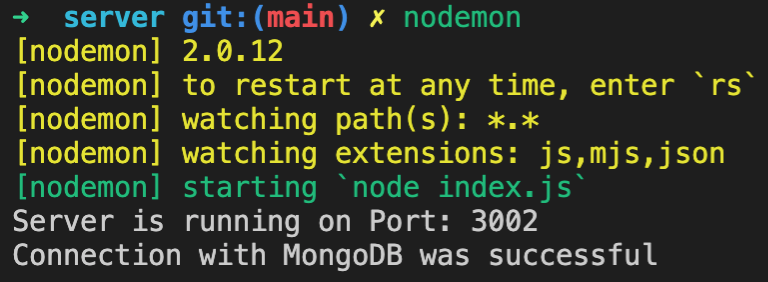

# Video Search Project - API - Server Side

- [Video Search Project - API - Server Side](#video-search-project---api---server-side)
  - [Overview](#overview)
  - [Installation Python Environment](#installation-python-environment)
  - [Server Installation](#server-installation)
  - [Keyframe MongoDB Structure](#keyframe-mongodb-structure)

## Overview

The server side implementation is split into two parts.

The keyframe extraction, image classification and storing of those values into separate image files and the mongoDB is done in the subfolder `image-classification`, which uses Python for those tasks (see [Python Installation](#installation-python-environment)).

The server, that provides exposes the mongoDB to potential client applications is in the  `server` subfolder. The installation and startup guide can be found in the section [Server Installation](#installation-server-environment).

## Installation Python Environment

This project used Anaconda as the Python environment.

To install this environment, please enter the following command in the `image-classification` directory of this project in your terminal:

` conda env create -f environment.yml`. Then activate the environment using the command: `conda activate video_search_project`.

This should install the dependencies needed for this assignment.

Afterwards, it should be possible to run the code from the project root using the command: `python main.py`.
This will execute the shot detection and saves the detected shots in a folder called `detected_shots`.

Note: OpenCV version `4.5.1.48` was used for this project, but was not specified in the `.yml` file and all OpenCV versions >= `4.2 should probably work just fine.

## Server Installation

A server is needed for communicating with the `mongoDB` collection.
The dependencies of this server need to be installed with the command `npm install`.
To start this server, change to the `server` directory and enter the command `nodemon` in a terminal.
After executing the command, the following should be displayed:



## Keyframe MongoDB Structure

The following shows an extracted mongoDB document of collection type `keyframe_documents` of the provided project.
This document was extracted from the first keyframe of the video `07031.mp4`.

```json
{
  _id: ObjectId("60fb3c57cb1b1f6f731ceb65"),
  keyframe_id: '0.png',
  file_path: '07031',
  classifier: 'resnet',
  concept_confidence: [
    { concept: "644: 'matchstick',", confidence: 0.0378227126134408 },
    {
      concept: "111: 'nematode, nematode worm, roundworm',",
      confidence: 0.021119676276033252
    },
    {
      concept: "818: 'spotlight, spot',",
      confidence: 0.016664525775251633
    },

    ...

    { concept: "845: 'syringe',", confidence: 0.009476279307357952 }
  ]
}
```
